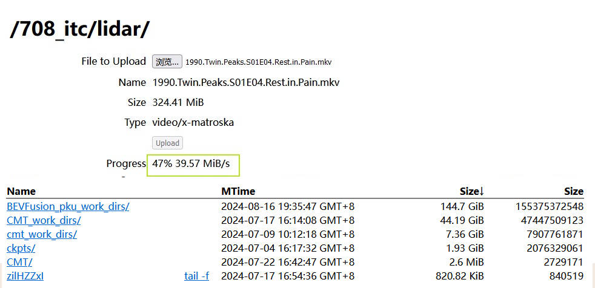

# HTTP File Transfer Server
Handy tool to share files with your friends.

With any recent web browser, you can download and upload files to this http server.

## Frontend Features
* simple responsive html form supported by `simpleresponsive.css`
* ajax file uploading implemented with native frontend javascript(embedded in `index.mustache`)

## Backend Features
* implemented with node.js 
* native node.js to list directory and serve static file downloading
* use `mustache` to render html to frontend
* use `formidable` to process file uploading 

## How to run it

1. clone this repo to places like `~/http-file-transfer-server`, and `npm install` all dependencies.
2. `cd /your/web/root/folder`
3. `node ~/http-file-transfer-server/app.js`, then all download/upload will happen under `/your/web/root/folder`.